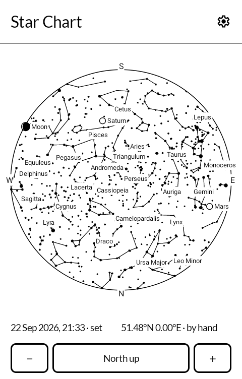
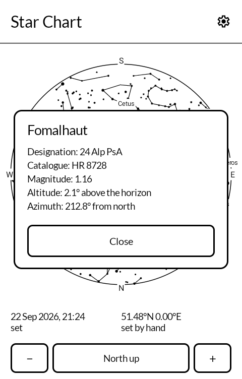
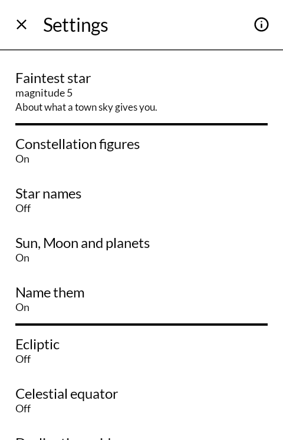
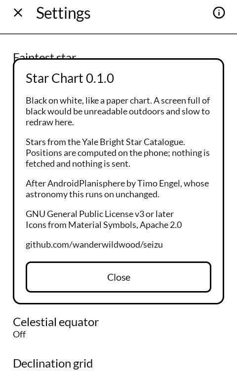

# Star Chart

星図 *seizu*

The sky over you, drawn the way a paper star atlas draws it: black marks on white, for an
E Ink phone you can take outside.

Built for the [Mudita Kompakt](https://mudita.com/products/kompakt/), whose 4.3" panel has
sixteen greys, a slow redraw, and is read outdoors as often as indoors.

## Screenshots

| | | | |
|---|---|---|---|
|  |  |  |  |

## Why it is not white-on-black

Every other star chart on a screen draws white stars on a black field, because it is
imitating the night. Here that would be the worst possible choice. A full screen of black
is the slowest and most ghost-prone thing an E Ink panel can be asked to hold; it cannot
be read in the daylight this phone is otherwise good in; and it drowns every mark that has
to sit on top of it.

Printed star atlases have been black-on-white for four hundred years, and they are the
ones people actually take outdoors and read by torchlight. That is the situation this is
for.

## What it shows

- **Nine thousand stars** from the Yale Bright Star Catalogue, sized by magnitude. On a
  screen with no brightness to spare, size carries the whole of that information.
- **The constellation figures**, their names — in Latin, in English or as the three-letter
  abbreviation — and, if you want them, the IAU boundaries.
- **Sun, Moon and the planets**, drawn as rings so they are never mistaken for stars.
- **The ecliptic, the celestial equator, a declination grid and circles of altitude**,
  each optional.
- **Zoom.** Pinch, or the − and + either side of the facing button; drag to move about;
  double tap to put the whole sky back on the screen.
- **Any moment, anywhere.** Set the time and the place by hand — the useful question is
  usually what will be up at ten tonight from a campsite next week, not what is overhead
  indoors right now.
- **Step an hour or a day** either way, without typing a date. A day step keeps the hour
  of the clock, so the same night next week is one button four times, and the chart holds
  the moment you put it on rather than drifting back to the present.
- **Tap anything** for its designation, magnitude, altitude and bearing.

## The projection

Azimuthal equidistant, as on every paper planisphere: the point directly overhead is the
centre, the horizon is the rim, and distance from the centre is proportional to angle down
from the zenith.

The direction you are facing goes at the **bottom** of the chart, and the button under it
turns the whole thing. A planisphere is held up over your head and read from underneath,
which mirrors it — getting that backwards is how everyone ends up with Orion the wrong way
round.

## Drawing it small

A 4.3" disc has to hold nine thousand stars, eighty-eight figures and their names, and it
runs out of paper long before it runs out of sky. Three things keep it a chart rather than
a smudge.

**Hairlines.** Every mark is a multiple of one base width, and that base is about a
pixel: a bright star is a dot you can see is bigger, not a blob. Nothing is drawn thinner
than one pixel either, because a half-pixel line on a sixteen-grey panel is not a finer
line, it is a grey one, and grey is the one thing E Ink will not hold still. **Mark
weight** in the settings moves the whole drawing together — a hairline chart for indoors,
a heavy one for gloves and torchlight.

**Words that do not pile up.** Labels are collected as the chart is drawn and put down
last, in order of what you are most likely to be looking for: the compass, then the
planets, then the constellations, then the stars brightest first. A word that would land
on a word already written is dropped rather than printed over it, and every word is
knocked out of the drawing underneath in white, the way an engraver lifts a line out from
under a name.

**Somewhere to look.** Zoomed in, the rim and its four letters are off the panel, so the
compass letters are pinned to the edge of the screen in the direction they actually lie.
A chart you cannot orient is not a chart.

## What it does not do

One permission, `ACCESS_COARSE_LOCATION`, and only if you press "Ask the GPS". Typing a
latitude and longitude works without granting anything, and is the only way to chart
somewhere you are not.

**No `INTERNET` permission.** The catalogue ships inside the app and every position is
computed on the phone.

## Building

```
./gradlew assembleRelease
```

A release is signed by a keystore in `signing/`, which is not in this repository. Without
it the release APK builds **unsigned** and will not install anywhere — there is no fallback
key by design.

## Credit

After [AndroidPlanisphere](https://github.com/tengel/AndroidPlanisphere) by Timo Engel.

The layers came over with it: constellation names and boundaries, the azimuthal grid of
altitude circles, the choice of what to call a constellation, and a setting for how heavy
the marks are. What changed is what each is for on this screen — off by default where
upstream has them on, because ink that is free on a phone is not free here.

**The astronomy is his, and it is not rewritten.** `Astro.java`, `Kepler.java`,
`Planet.java`, `Catalog.java` and `ConstellationDb.java` are kept in their original package
so they stay diffable against upstream. Orbital mechanics is exactly the kind of code where
a porting slip produces a plausible-looking and completely wrong sky, and his version is
already exercised by a published app. The only edits are widening visibility so the Kotlin
above can call in; each is marked `// visibility widened`, and no arithmetic is touched.
One method, `ConstellationDb.getName`, is adapted to take a language index rather than read
an Android preferences object this fork does not carry; it is marked `ADAPTED`.

Everything above that line — the scene assembly, the projection, the drawing and the whole
interface — is new, in Jetpack Compose against [MMD](https://github.com/mudita/MMD),
Mudita's E Ink component library.

Star data is the **Yale Bright Star Catalogue**, 5th Revised Edition (Hoffleit & Warren);
`app/src/main/res/raw/bs_readme` is its own documentation, kept with it.

Icons are [Material Symbols](https://fonts.google.com/icons), Apache License 2.0.

## Checking it is right

A star chart cannot be proofread. Swap a right ascension for a declination and every object
moves somewhere else entirely, but the result is still a plausible sky full of plausible
constellations and nothing on the screen looks wrong.

So the Sun — the one object whose position anybody can state from first principles — is
pinned by tests: its noon altitude at an equinox is ninety minus the latitude, midsummer
noon is 47° above midwinter noon, it does not set inside the Arctic Circle in June, and it
stands in the north when seen from the southern hemisphere. One more test checks a moment
with no round numbers in it against a separately written NOAA-style calculation, because
symmetric cases hide sign errors.

Two real mistakes were caught that way while this was being built: the library returns
`(right ascension, declination)` in **degrees** where the horizontal conversion wants right
ascension in **hours**, and it measures azimuth **from south**, not from north.

## Licence

**GNU General Public License v3.0 or later.** See [LICENSE](LICENSE).

Note that this is *or later*, not the GPL-3.0-only these apps otherwise use. The work it
derives from was published under "version 3 of the License, or (at your option) any later
version", and that option was granted to everyone downstream. It is not mine to take away.

Copyright © wander wildwood, and © 2020 Timo Engel for the parts that are his.
